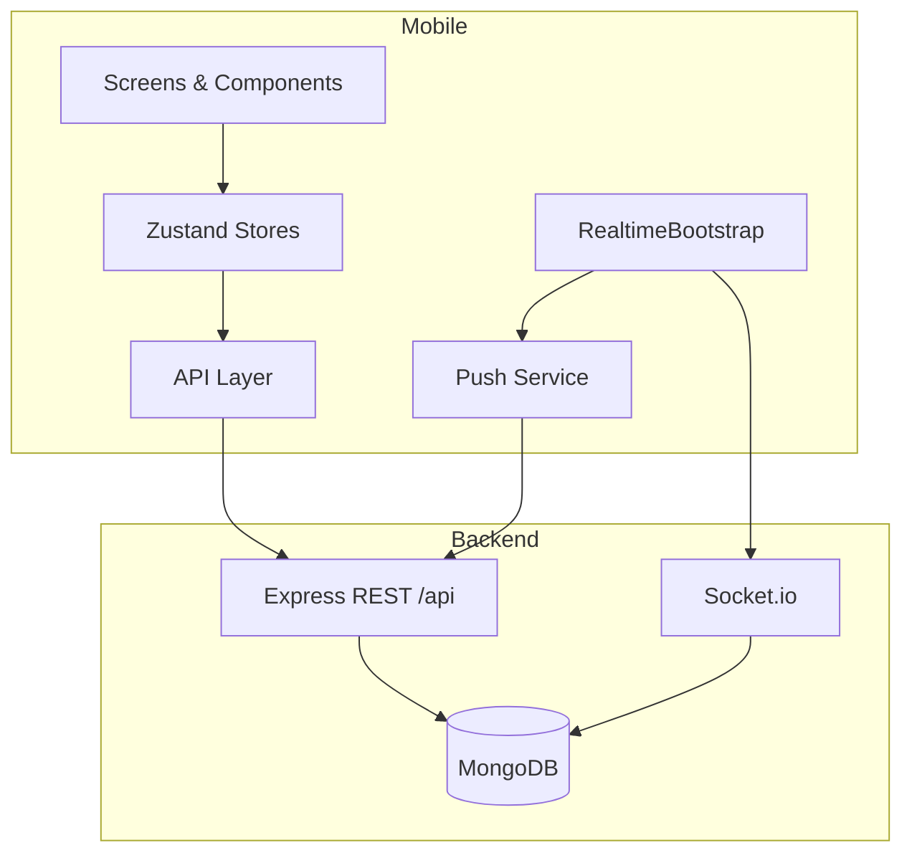

# SpareXChange Mobile — Project Presentation

## Overview

**SpareXChange Mobile** is a React Native (Expo SDK 56) client for the existing SpareXChange Node.js/Express backend. It delivers a full marketplace, exchange, sustainability, services, and community experience without modifying server code.

| Item | Detail |
|------|--------|
| Platform | Android (primary), iOS-capable via Expo |
| Framework | Expo SDK 56, React 19, React Native 0.85 |
| State | Zustand |
| Navigation | React Navigation 7 (tabs + modal stacks) |
| API | Axios + JWT (SecureStore) |
| Real-time | Socket.io client |
| Push | expo-notifications + backend token registry |

## Architecture



### Navigation model

- **Auth stack** — login, signup, MFA
- **Main tabs** — Browse, Sell, Trades, Services, Eco, Profile
- **Root sibling stacks** (full-screen overlays):
  - **Communication** — chat, notifications, reviews, disputes
  - **Operations** — admin analytics, reports, jobs
  - **Community** — feed, achievements, public profiles

This keeps tabs uncluttered while deep features remain one navigation call away.

## Module map (10 Postman collections)

| # | Module | Key screens | Backend prefix |
|---|--------|-------------|----------------|
| 1 | Identity & Security | Auth, Profile, MFA, Role verification | `/api/auth`, `/api/users/profile` |
| 2 | Marketplace | Browse, Listing CRUD, Recommendations | `/api/listings` |
| 3 | Exchanges | Proposals, handshake, disputes | `/api/exchanges` |
| 4 | Sustainability | Recycling, eco leaderboard | `/api/recycling-submissions`, `/api/users/leaderboard` |
| 5 | Professional Services | Requests, quotes, technicians | `/api/technician-requests` |
| 6 | Saved Search Alerts | Save/browse searches | `/api/users/saved-searches` |
| 7 | Communication & Trust | Messages, reviews, platform disputes | `/api/messages`, `/api/reviews`, `/api/disputes` |
| 8 | Operations & Intelligence | Admin dashboard, seller insights | `/api/admin` |
| 9 | Notifications & Real-time | Preferences, history, socket, push | `/api/notifications`, Socket.io |
| 10 | Community Engagement | Feed, public profiles, achievements | `/api/users/feed`, `/api/users/profile`, `/api/users/achievements` |

## Feature highlights

### Marketplace & inventory
- Grid/horizontal listing cards with Cloudinary and local `/uploads` image support
- Filters, recommendations, seller verification badges
- Full listing lifecycle from Sell tab

### Peer-to-peer exchanges
- End-to-end proposal → counter → handshake → handover → completion
- Photo evidence and exchange-scoped disputes

### Sustainability loop
- Recycling submissions with QR workflow
- Eco points and tier display integrated with profile and community

### Trust & communication
- Thread-based messaging with socket-driven refresh
- Reviews tied to completed exchanges
- User reporting and notification center with preference controls

### Community & gamification
- Platform highlights (top contributors, recyclers, trusted members)
- Personal and public activity feeds
- Achievement definitions, progress, unlock check, leaderboard
- Rich public profiles with listings and review summaries

### Operations (role-gated)
- Analytics hub, reports, background jobs for admin-permission users
- Seller-facing market insights for demand analytics

## Technical decisions

1. **No backend changes** — mobile adapts to existing API shapes (e.g. `cancelReason`, optional push stub).
2. **Centralized API client** — interceptors attach JWT and normalize errors.
3. **Asset URL resolver** — single helper for Cloudinary vs relative upload paths.
4. **RealtimeBootstrap** — starts socket + push on auth; stops and unregisters on logout.
5. **Modular stores** — one Zustand store per domain mirrors Postman modules for maintainability.

## Quality verification

- Android bundle export: **1507 modules** (post Module 10)
- Manual flows documented in [SETUP_AND_TESTING.md](./SETUP_AND_TESTING.md)
- Backend module tests available under `tests/backend/module*/`

## Demo flow (5 minutes)

1. **Sign in** → show profile eco points and trust score  
2. **Browse** → open listing → tap seller card → public profile  
3. **Propose exchange** → Trades tab → handshake progress  
4. **Eco** → recycling or leaderboard  
5. **Community** → highlights → Achievements → check badges  
6. **Messages** → live refresh via socket (with backend running)  
7. **Admin** (if applicable) → Operations dashboard  

## Future enhancements (out of scope)

- Full FCM/APNs when backend push provider is configured
- Offline caching and optimistic message UI
- iOS TestFlight / App Store pipeline
- Deep linking from push notification payloads

## Repository layout

```
spareXchange-master/
  backend/           # Express API (unchanged)
  mobile/            # This app
  Module*_Postman_*.json
  mobile/docs/       # Setup, presentation, deployment guides
```

---

**SpareXChange Mobile** — circular economy marketplace with trust, sustainability, and community built in.
